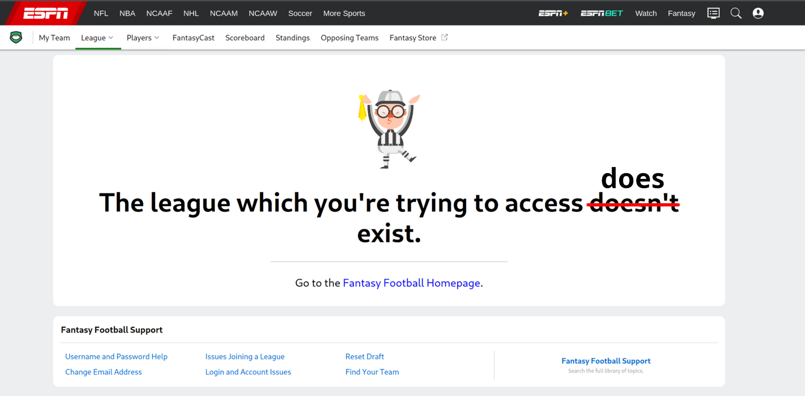

# Fantasy Football Archive

Go-based RESTful API for accessing historical fantasy football data extracted from ESPN and stored locally in a PostgresSQL database. The API lets you query your past fantasy football league data, including league standings, team performance, drafts, and more.

This data was retrieved from ESPN's API using [cwendt94's espn-api](https://github.com/cwendt94/espn-api) and wouldn't be possible without his amazing work!

Checkout the rest of the background and motivations for this projcect [here](https://litts.me/projects/2025/first/)

### Prerequisites

- Go (version 1.23 or higher)
- PostgreSQL database with the exported ESPN data (see my other project for instructions on how to export the data, coming soon)